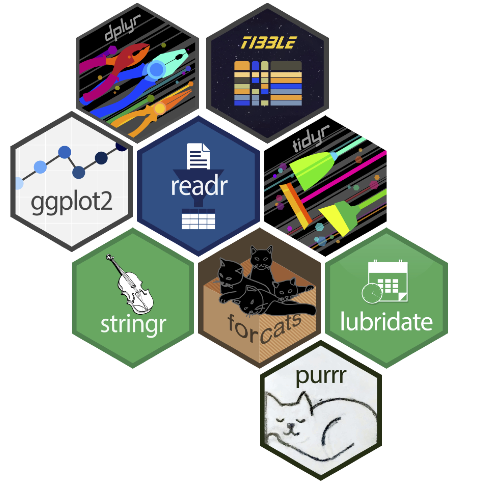

## Outline

<br/>

::: {.incremental}
1. What is R and RStudio?
2. Types of data and data structure in R.
3. R packages.
4. Introduction to Tidyverse.
:::

## What is R?

::: {.incremental}
- [R](https://www.r-project.org/about.html){style="color:#cc0000"} is an open-source programming language for statistical computing.

- It was initially written by 
  Ross Ihaka   {width=60px style="vertical-align:middle; border-radius:50%"}  and 
  Robert Gentleman
    {width=60px style="vertical-align:middle; border-radius:50%"} 
  at Department of Statistics, University of Auckland, New Zealand during 1990s.

- The [R Core Team](https://www.r-project.org/contributors.html){style="color:#cc0000"} was founded in 1997 to maintain the R source code.
:::

## What is RStudio?

::: {.incremental}
- RStudio (now Posit) is an Integrated Development Environment for R. It makes R programming easier and more efficient.

- R is the engine - it does the actual computation. RStudio sends your code to R, and R returns the results.
:::


## Getting started

<br/>
<br/>
<br/>

You need the R [language](https://cloud.r-project.org/)
<br/>
<br/>

. . .

And also the [software](https://www.rstudio.com/products/rstudio/download/#download)


## Navigating RStudio

::: {.absolute top="10%" left="50%" width="1031" height="529" style="transform: translateX(-50%); text-align: center;"}

:::
::: {.absolute top="66%" left="70%" style="transform: translateX(-50%); color: #cc0000; font-size: 0.8em; background-color: rgba(255,255,255,0.8); padding: 5px 10px; border-radius: 5px;"}
**Files pane** — View and manage project files and folders.
:::

. . .

::: {.absolute top="10%" left="50%" width="1031" height="529" style="transform: translateX(-50%); text-align: center;"}

:::
::: {.absolute top="60%" left="70%" style="transform: translateX(-50%); color: #cc0000; font-size: 0.8em; background-color: rgba(255,255,255,0.8); padding: 5px 10px; border-radius: 5px;"}
**Plots pane** — Displays visualizations and charts generated in R.
:::

. . .

::: {.absolute top="10%" left="50%" width="1031" height="529" style="transform: translateX(-50%); text-align: center;"}

:::
::: {.absolute top="66%" left="70%" style="transform: translateX(-50%); color: #cc0000; font-size: 0.8em; background-color: rgba(255,255,255,0.8); padding: 5px 10px; border-radius: 5px;"}
**Packages pane** — Manage, load, and view installed packages.
:::

. . .

::: {.absolute top="10%" left="50%" width="1031" height="529" style="transform: translateX(-50%); text-align: center;"}

:::
::: {.absolute top="66%" left="70%" style="transform: translateX(-50%); color: #cc0000; font-size: 0.8em; background-color: rgba(255,255,255,0.8); padding: 5px 10px; border-radius: 5px;"}
**Help pane** — Search and read R function documentation.
:::

. . .

::: {.absolute top="10%" left="50%" width="1031" height="529" style="transform: translateX(-50%); text-align: center;"}

:::
::: {.absolute top="75%" right="60%" style="transform: translateX(25%); color: #cc0000; font-size: 0.8em; background-color: rgba(255,255,255,0.8); padding: 5px 10px; border-radius: 5px;"}
**Console** — Where R code is executed and results are displayed.
:::

. . .

::: {.absolute top="10%" left="50%" width="1031" height="529" style="transform: translateX(-50%); text-align: center;"}

:::
::: {.absolute top="30%" right="65%" style="transform: translateX(30%); color: #cc0000; font-size: 0.8em; background-color: rgba(255,255,255,0.8); padding: 5px 10px; border-radius: 5px;"}
**Source editor** — Write, edit, and save your R scripts.
:::

. . .

::: {.absolute top="10%" left="50%" width="1031" height="529" style="transform: translateX(-50%); text-align: center;"}

:::
::: {.absolute top="42%" left="67%" style="transform: translateX(-50%); color: #cc0000; font-size: 0.7em; background-color: rgba(255,255,255,0.8); padding: 5px 10px; border-radius: 5px;"}
**Environment** — View and manage the objects, data, and variables in your current R session.
:::

## Basic Syntax in R

- R stores both data and results in objects (like labeled containers).

. . .

- Data are assigned to and stored in objects using the two assignment operators `<-` or `=`

```{r}
# Example: Store a number or text in an object to reuse it.
my_number <- 42
age <- 30
my_name = "Alice"
```

. . .

- R is case-sensitive

```{r}
age <- 30; Age <- 40; AGE <- 25;
```

## Basic Syntax in R

- We use `#` to add a comment in a code

```{r}
# This is a comment and R won't execute it

```

. . .

- Object names start with letters or dots (.), but not numbers.
- Can contain letters, numbers, underscores (_), and dots (.), but no spaces. Common Naming Styles:

```{r}
student_scores <- 10 # snake_case
studentScores <- 10 # camelCase
```

## Data types in R

- Data types define the kind of data R can work with.

::: {.columns}
:::{.column width=60%}

::: {.incremental}
- R’s main data types:
  - Numeric: Numbers.
  
  - Character: Text or strings.
  
  - Logical: TRUE or FALSE values.
  
  - Integer: Whole numbers.
  
- Use the `typeof()` function to check a data type
:::
:::
::: {.column width=40%}
:::
:::

## Data types in R

- Data types define the kind of data R can work with.

::: {.columns}
:::{.column width=60%}
- R’s main data types:
  - Numeric: Numbers.
  
  - Character: Text or strings.
  
  - Logical: TRUE or FALSE values.
  
  - Integer: Whole numbers.
  
- Use the `typeof()` function to check a data type
:::
::: {.column width=40%}

```{r}
#| eval: false
#| echo: true
# Numeric/double
x <- 42
typeof(x)

# Character
y <- "Hello"
typeof(y)

# Logical
z <- TRUE
typeof(z)

# Integer needs L
w <- 42L
typeof(w)

```

:::
:::

## Data Structures in R

- Data structures are ways to organize and store data in R so you can work with it efficiently.

::: {.incremental}

- Main data structures in R:

:::

## Vectors in R

Vectors are the most basic data structure - a collection of elements of the same type.

. . .

**Creating vectors:**

- **c()** function combines elements

. . .

**Vector operations:**

- Access elements with `[index]`


## Vectors in R

Vectors are the most basic data structure - a collection of elements of the same type.

```{webr-r}
# Different vector types
nums <- c(10, 20, 30)
chars <- c("apple", "banana", "cherry")
logicals <- c(TRUE, FALSE, TRUE)

# Vector operations
nums * 2        # multiply all by 2
nums[2]         # get second element
length(nums)    # vector length

# Try your own vectors!

```

## Matrices in R

Matrices are two-dimensional arrays where all elements must be the same data type.

. . .

**Creating matrices:**

- **matrix()** function with data and dimensions
- **nrow**: number of rows
- **ncol**: number of columns
- **byrow**: fill by rows (TRUE) or columns (FALSE)

. . .

**Matrix operations:**
- Access with `[row_index, column_index]`


## Matrices in R

Matrices are two-dimensional arrays where all elements must be the same data type.

```{webr-r}
# Create a matrix
mat <- matrix(1:12, nrow = 3, ncol = 4)
mat

# Matrix dimensions
dim(mat)
nrow(mat)
ncol(mat)

# Access elements
mat[2, 3]       # row 2, column 3
mat[1, ]        # entire first row
mat[, 2]        # entire second column

```

## Lists in R

Lists can hold different data types and structures

. . .

**Lists characteristics:**

- **Mixed data types**: numbers, text, vectors, even other lists
- **Named elements**: use `$` to access by name
- **Flexible length**: elements can be different sizes
- **Nested structures**: lists within lists

. . .

**Accessing list elements:**

- `list$name` or `list[["name"]]`

- `list[[index]]` for position

## Lists in R

Lists can hold different data types and structures

```{webr-r}
# Create a mixed list
my_list <- list(
  name = "John",
  age = 25,
  scores = c(85, 90, 78),
  married = TRUE
)

my_list

# Access elements
my_list$name
my_list$scores
my_list[[2]]    # age by position

```

## Data Frames in R

Data frames are like spreadsheets - the most common structure for real data analysis.

. . .

**Data frame features:**

- **Rows and columns**: like a table

- **Mixed data types**: different columns can have different types

- **Named columns**: each column has a name

- **Same length**: all columns must have same number of rows


## Data Frames in R

Data frames are like spreadsheets - the most common structure for real data analysis.

. . .

**Common operations:**

- `df$column` to get a column by name

- `df[row_index, column_index]` to get specific cell

- `df[row_index, ]` to get entire row

- `df[, column_index]` to get entire column

## Data Frames in R

Data frames are like spreadsheets - the most common structure for real data analysis.

```{webr-r}
# Create a data frame
students <- data.frame(
  name = c("Alice", "Bob", "Carol"),
  age = c(20, 22, 21),
  grade = c("A", "B", "A"),
  passed = c(TRUE, TRUE, TRUE)
)

students

# Access columns by name
students$name
students$age

```

## Interactive Data Structure Explorer

Try creating and exploring different data structures:

```{webr-r}
# Practice area - experiment with data structures!

# 1. Create your own vector


# 2. Make a matrix


# 3. Build a list


# 4. Construct a data frame


# Use functions like str(), class(), length(), dim() to explore!

```


## R Packages

- R packages are collections of functions, data, and documentation that extend R's capabilities.

. . .

- There are two main steps to use a package: install it, then load it.

. . .

```{webr-r}
# Installing a package
install.packages("tidyverse")
library(tidyverse)
```


## Tidyverse

::: {.columns}
::: {.column width=70%}
- The tidyverse is a collection of R packages designed for data science with a consistent philosophy and syntax.
- It is designed to make it easy to install and load its core packages in a single command.
:::
::: {.column width=30%}

 
:::
:::

## Core packages we will use

- `dplyr` for data manipulation

- `tidyr`  for tidying data

- `ggplot2` for data visualization

## Common functions

::: {.incremental}

- `%>%`/`|>` Chains operations together

- `filter` keeps or discards rows (observations)

- `select` keeps or discards columns (variables)

- `count` tallies data set by certain variable(s)

- `mutate` creates new variables/modify existing variables

- `group_by`/`summarize` aggregates data ([pivot tables]{style="color:#cc0000"})

:::

## Importing data in R

Data rarely comes ready-made in R - you need to import it from external files.

. . .

**Common data file formats:**

- **CSV files**: Comma-separated values (most common)
- **Excel files**: .xlsx or .xls spreadsheets

## Importing data in R

- Base R approach: `read.csv`
- Tidyverse approach: `read.csv`
- Tidyverse approach: `read_excel`

## Importing data in R

- Base R approach: `read.csv`
- Tidyverse approach: `read.csv`
- Tidyverse approach: `read_excel`

```{r}
#| echo: false
library(tidyverse)
pfpr_data <- read_csv("data/pfpr_intvn.csv")
opts <- options(knitr.kable.NA = "")
```

## Plasmodium falciparum Parasite Rate (PfPr)

<br>

```{r}
#| eval: false
pfpr_data <- read.csv("data/pfpr_intvn.csv")
pfpr_data
```

<br>

::: {style="font-size: 0.75em"}
```{r}
#| echo: false
knitr::kable(pfpr_data %>% head(6))
```
:::

## Filter

- `filter` keeps or discards rows (observations)

- The `==` operator tests for equality

. . .

```{r}

# Filter urban data only
urban_data <- filter(pfpr_data, residence == "urban")

```

::: {style="font-size: 0.75em"}
```{r}
#| echo: false
knitr::kable(urban_data |> head(5))
```
:::

## Filter

- `filter` keeps or discards rows (observations)

- The `==` operator tests for equality

- Using the pipe operator `%>%`

```{r}

# Filter urban data only
urban_data <- pfpr_data %>% filter(residence == "urban")

```

::: {style="font-size: 0.75em"}
```{r}
#| echo: false
knitr::kable(urban_data |> head(5))
```
:::

## Filter

- `filter` keeps or discards rows (observations)

- The `==` operator tests for equality

- Using the pipe operator `|>`

```{r}

# Filter urban data only
urban_data <- pfpr_data |> filter(residence == "urban")

```

::: {style="font-size: 0.75em"}
```{r}
#| echo: false
knitr::kable(urban_data |> head(5))
```
:::

## Filter

- `filter` keeps or discards rows (observations)

- The `==` operator tests for equality

- Using the pipe operator `|>`

```{r}

# Filter urban data only
urban_data <- pfpr_data |> 
  filter(residence == "urban")

```

::: {style="font-size: 0.75em"}
```{r}
#| echo: false
knitr::kable(urban_data |> head(5))
```
:::

## Filter

- `filter` keeps or discards rows (observations)

- The `|` operator signifies "or"

. . .

```{r}
nairobi_mombasa <- pfpr_data |> 
  filter(county == "Nairobi" | county == "Mombasa")
```

::: {style="font-size: 0.75em"}
```{r}
#| echo: false
knitr::kable(nairobi_mombasa |> head(5))
```
:::

## Filter

- `filter` keeps or discards rows (observations)

- The `%in%` operator allows for multiple options

. . .

```{r}
several_counties <- pfpr_data |> 
  filter(county %in% c("Nairobi", "Mombasa", "Kisumu"))
```

::: {style="font-size: 0.75em"}
```{r}
#| echo: false
knitr::kable(several_counties |> head(5))
```
:::

## Filter

- `filter` keeps or discards rows (observations)

- The `&` operator combines conditions

. . .

```{r}
urban_2020 <- pfpr_data |>
  filter(residence == "urban" & year == 2020)
```

::: {style="font-size: 0.75em"}
```{r}
#| echo: false
knitr::kable(urban_2020 |> head(5))
```
:::

## Select

- `select` keeps or discards columns (variables)

. . .

```{r}
county_prev <- pfpr_data |>
  select(county)
```

::: {style="font-size: 0.75em"}
```{r}
#| echo: false
knitr::kable(county_prev |> head(5))
```
:::

## Select

- `select` keeps or discards columns (variables)

```{r}
county_prev <- pfpr_data |>
  select(county, pfpr)
```

::: {style="font-size: 0.75em"}
```{r}
#| echo: false
knitr::kable(county_prev |> head(5))
```
:::

## Select

- `select` can drop columns with -`column`

```{r}
county_prev <- pfpr_data |>
  select(-county, -pfpr)
```

::: {style="font-size: 0.75em"}
```{r}
#| echo: false
knitr::kable(county_prev |> head(5))
```
:::

## Mutate

- `mutate` creates new variables (with a single `=`)

. . .

```{r}
pfpr_data_percent <- pfpr_data |>
  mutate(itn_percent = itn_coverage * 100)
```

::: {style="font-size: 0.75em"}
```{r}
#| echo: false
knitr::kable(pfpr_data_percent |> head(5))
```
:::

## Mutate

- `mutate` can create multiple variables

```{r}
pfpr_data_percent <- pfpr_data |>
  mutate(
    itn_percent = itn_coverage * 100,
    pfpr_percent = pfpr * 100
    )
```

::: {style="font-size: 0.6em"}
```{r}
#| echo: false
knitr::kable(pfpr_data_percent |> head(5))
```
:::

## Mutate

- `mutate` can modify existing variables

```{r}
pfpr_data_percent <- pfpr_data |>
  mutate(
    pfpr = round(pfpr, 3),
    itn_coverage = round(itn_coverage, 2)
    )
```

::: {style="font-size: 0.6em"}
```{r}
#| echo: false
knitr::kable(pfpr_data_percent |> head(5))
```
:::


## Group by / summarize

- `group_by`/`summarize` aggregates data

- `group_by()` identifies the grouping variable(s)

- `summarize()` specifies the aggregation 
. . .

```{r}
mean_pfpr <- pfpr_data |>
  group_by(county) |>
  summarise(average_pfpr = mean(pfpr))
```

::: {style="font-size: 0.6em"}
```{r}
#| echo: false
knitr::kable(mean_pfpr |> head(5))
```
:::

## Group by / summarize

- `group_by`/`summarize` aggregates data

- `group_by()` identifies the grouping variable(s)

- `summarize()` specifies the aggregation 

```{r}
county_observations <- pfpr_data |> 
  group_by(county) |> 
  summarise(count = n())
```

::: {style="font-size: 0.6em"}
```{r}
#| echo: false
knitr::kable(county_observations |> head(5))
```
:::

## Group by / summarize

- `group_by`/`summarize` aggregates data

- `group_by()` identifies the grouping variable(s)

- `summarize()` specifies the aggregation 

```{r}
residence_average <- pfpr_data |> 
  group_by(county, residence) |>
  summarise(average_pfpr = mean(pfpr))
```

::: {style="font-size: 0.6em"}
```{r}
#| echo: false
knitr::kable(residence_average |> head(5))
```
:::

## Group by / summarize

- `group_by`/`summarize` aggregates data

- `group_by()` identifies the grouping variable(s)

- `summarize()` specifies the aggregation 

```{r}
average_itn_pfpr <- pfpr_data |> 
  group_by(year, residence) |>
  summarise(
    average_pfpr = mean(pfpr),
    average_itn = mean(itn_coverage)
  )
```

::: {style="font-size: 0.5em"}
```{r}
#| echo: false
knitr::kable(average_itn_pfpr |> head(5))
```
:::


